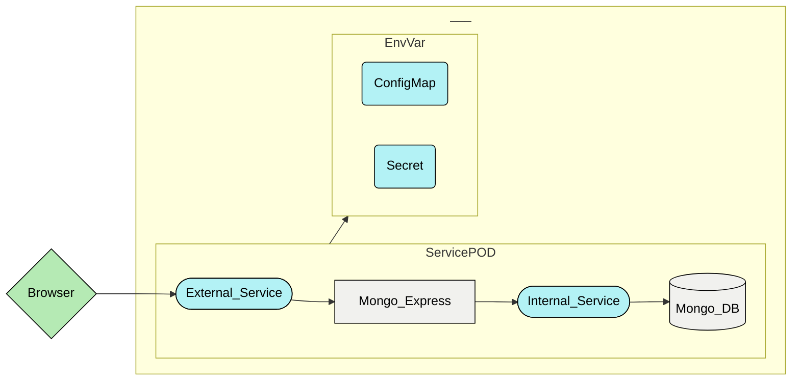

# Project Kubernets

This is the first project made with Kubernets. <br/>
For learning more about this technology I watched a tutorial on [Youtube](https://www.youtube.com/watch?v=X48VuDVv0do) made by Nana.

## Scope of the project

Acquire knowledge about **Kubernetes** and his components and create a first simple cluster with the following components.


## Component List

- **Mongo_DB** / **Mongo_Express**: This components are called **PODS** or deployments. <br/>
  They are an abstraction of the container where the docker-image run for better managment. <br/>

- **External_Service** / **Internal_Service**: The components Service grants a connection between Cluster components.<br/>
  Normally Kubernetes assign to the components an IP Address for reach it, the problem is that the IP is unique, so if the 
  component, in a future, will die the other components don't know the IP of the new POD. <br/>
  So the service component is used for creating a "DNS" system for avoid this problem. <br/>
  We create 2 service: **Internal** for the connection between cluster components and **External** for access to the cluster 
  from the outside (Browser).

- **Secret** / **Config.Map**: This service is used to store the env var that the pod use of their components (For example the access to the deb). <br/>
The main difference between **Secret** & **Config** is that the value stored in secret will be encrypted base64 and the value stored in the Config.map will be in on clear.

## Installation

### What you need?

For run and test this K8s Cluster you need 3 programs:
- **minikube**: is local Kubernetes, focusing on making it easy to learn and develop for Kubernetes.
- **kubectl**: Interface to interact with K8s Cluster and its components.
- **hypervisor / container / VMs**

Useful installation [GUIDE](https://www.youtube.com/watch?v=TAM-DLPX9XA).

### Create Pod / Service

Once you have all installed clone this repo with the following command:
```
git clone https://gitlab.com/Grake17/kube-exercise.git
```
and run the commands below in the same order
```ps1
1°- kubectl apply -f .\Projects\Demo\secretFile01.yaml
2°- kubectl apply -f .\Projects\Demo\configMap_general.yaml
3°- kubectl apply -f .\Projects\Demo\mongoDB_componets.yaml
4°- kubectl apply -f .\Projects\Demo\mongoDB_componets.yaml
```

## Check the pod / service

With the command `kubectl get pod/deployment/service/secret/configmap` you can check all components current state.

## Start Cluster

For access to the cluster run the command `minikube service external-express`.
